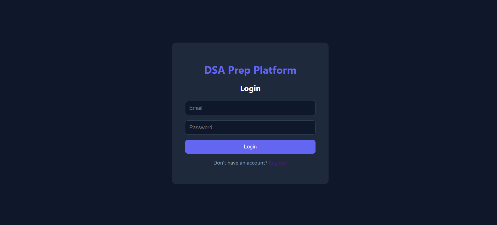
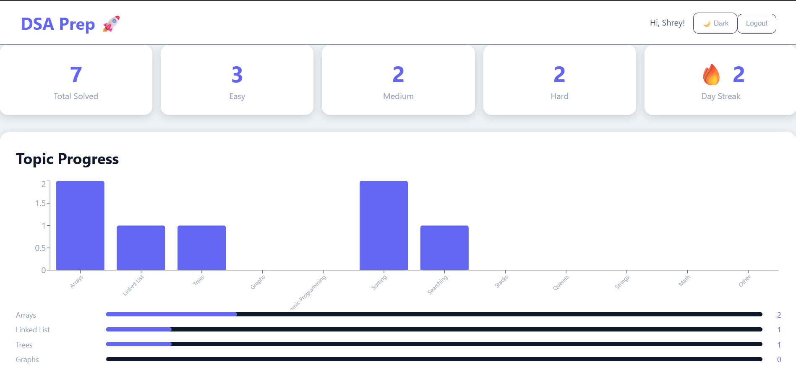
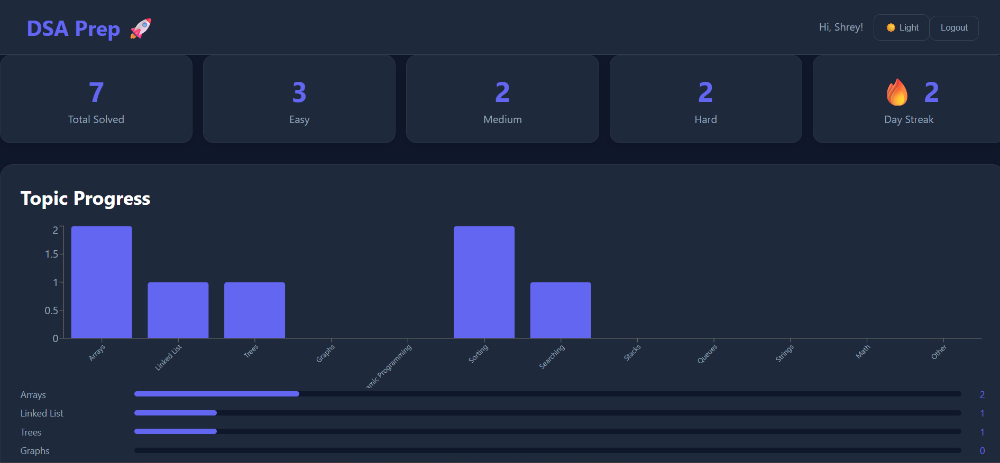

# 🚀 DSA Prep Platform

A full-stack web application to track Data Structures & Algorithms (DSA) practice, monitor progress, maintain daily streaks, and visualize performance through an interactive dashboard.

## 🌐 Live Demo

Frontend: https://dsa-prep-platform.vercel.app

Backend: https://dsa-prep-platform.onrender.com

## ✨ Features

### 🔐 Authentication

* User Registration
* User Login
* JWT-based Authentication
* Protected Routes

### 📝 Question Management

* Add DSA Questions
* Edit Questions
* Delete Questions
* View Recent Questions

### 🔍 Search & Filters

* Search Questions by Title
* Filter by Topic
* Filter by Difficulty

### 📊 Analytics Dashboard

* Total Questions Solved
* Easy / Medium / Hard Statistics
* Topic-wise Progress Tracking
* Interactive Charts

### 🔥 Daily Streak System

* Track Daily Activity
* Current Streak Counter
* Consistent Practice Monitoring

### 🎨 User Experience

* Dark Mode / Light Mode
* Responsive Design
* Clean Dashboard UI

## 🛠️ Tech Stack

### Frontend

* React.js
* Axios
* Recharts
* CSS-in-JS

### Backend

* Node.js
* Express.js
* MongoDB
* Mongoose
* JWT Authentication

### Deployment

* Vercel (Frontend)
* Render (Backend)

## 📸 Screenshots

Add screenshots of:

1. Login Page
2. Dashboard
3. Dark Mode
4. Add Question Form

## 🚀 Installation

### Clone Repository

git clone https://github.com/Shrey2006865/dsa-prep-platform.git

### Frontend

cd frontend
npm install
npm start

### Backend

cd backend
npm install
npm run dev

### Environment Variables

Create a .env file in backend:

MONGO_URI=your_mongodb_connection_string
JWT_SECRET=your_secret_key

## 📈 Future Improvements

* Achievement Badges
* Weekly Analytics
* Calendar Heatmap
* AI-Powered Hints
* Coding Contest Tracker
  ## 📸 Screenshots

### Login Page

### Dashboard (Light Mode)

### Dashboard (Dark Mode)

## 👨‍💻 Author

Shreyash Tajne

GitHub: https://github.com/Shrey2006865
